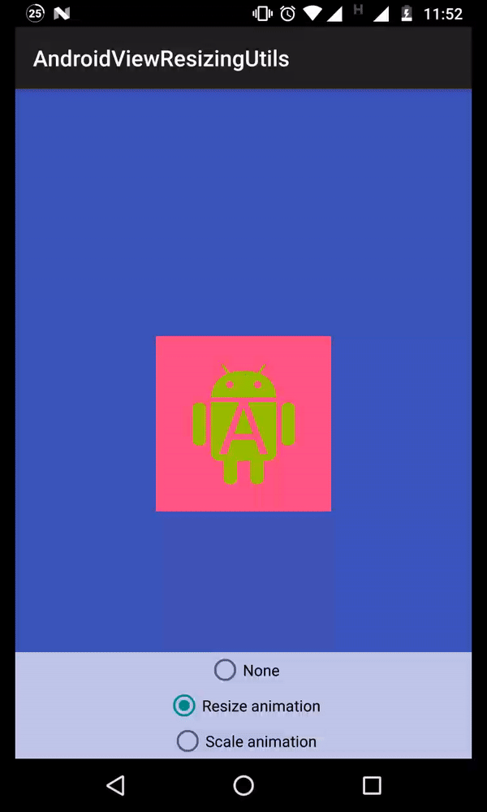

# Fluent view resizing for Android

## Basic usage
```java
ViewParams.of(someView)
        .width(widthPx)
        .heightRes(R.dimen.height)
        .margins(0)
        .marginLeftRes(R.dimen.horizontal_margin)
        .marginRightRes(R.dimen.horizontal_margin)
        .apply();
```

## Animation

```java
ViewParams.of(findViewById(R.id.container))
                .animate()
                .widthBy(value)
                .heightBy(value)
                .repeatInfinitely()
                .repeatModeReverse()
                .setDuration(DURATION_MS)
                .start();
```

